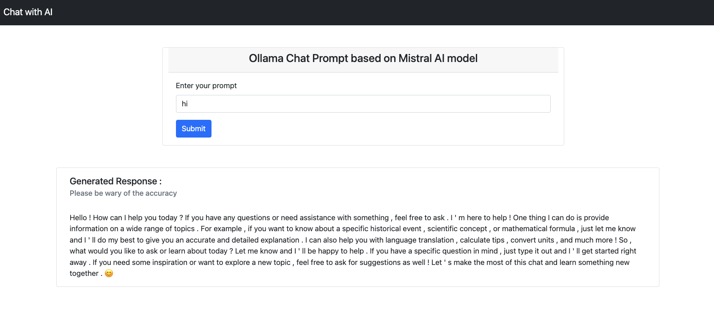

# Spring AI using Ollama backed by Mistral AI model

This repository demonstrates basic usage of generating prompt based response from Spring AI application.

## Usage

### Enabling AI model
Install ollama as per your OS using steps mentioned [here](https://ollama.com/download).
Verify ollama cli is up and running and then download the Mistral AI model as - 
`ollama run mistral`

### Running application
To use the repo, clone the code, build and run using maven.

`mvn clean install`

`mvn spring-boot:run`

Launch browser and open path `http://localhost:8086/ai/index`

Test out any prompt and get response

